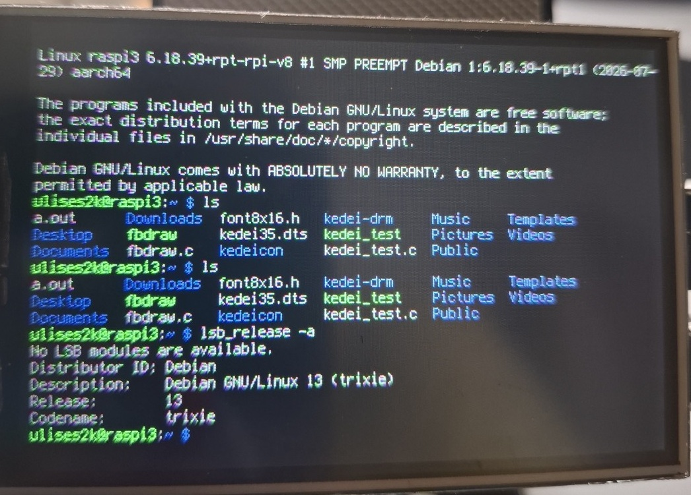

# kedeicon — KeDei 3.5" v5.0 on Raspberry Pi (that actually works)

A tiny **userspace** C daemon that mirrors the Linux text console onto a
**KeDei 3.5" v5.0** TFT (the notorious ILI9486-clone panel driven through three
74HC595 shift registers), over `/dev/spidev` — **no kernel driver**.

If you bought one of these panels, fought with `fbtft`/`fb_ili9486`/vendor DKMS
blobs, and ended up with a **blank screen or full-screen noise**, this repo is for
you. It paints cleanly.



Verified on a Raspberry Pi 3B+ with Debian 13 (trixie), kernel 6.18, driving the
console at 80×26 characters in landscape.

---

## Why this exists

The KeDei 3.5" panels do **not** speak a standard ILI9486 SPI protocol. They sit
behind three 74HC595 shift registers with a custom framing, so stock `fbtft`
drivers don't drive them, and the vendor's binary kernel modules are tied to old
kernels.

People who get a kernel driver going often hit a second wall: **full-frame writes
corrupt into RGB noise**. That's a Broadcom `bcm2835` SPI problem when thousands
of tiny transfers are issued from *kernel* context. The exact same protocol issued
from **userspace** (`spidev` + `ioctl`) paints perfectly.

So `kedeicon` stays 100% userspace. It:

- initialises the panel with the reverse-engineered KeDei sequence,
- keeps an in-RAM RGB565 framebuffer,
- **mirrors your text console** (`/dev/vcsa1` = tty1) onto the panel,
- only re-sends the character cells that changed (partial updates), and
- runs as a `systemd` service that survives reboots.

## Features

- ✅ Clean image — no noise band, no corruption.
- ✅ Live mirror of the real Linux text console (login prompt, shell, `dmesg`, …).
- ✅ **80×26 character grid** (full 80-column console fits) using a 6×12 font.
- ✅ VGA 16-colour attributes (your shell prompt keeps its colours).
- ✅ Blinking block cursor.
- ✅ Landscape or portrait, flip/mirror — all in software, one env var.
- ✅ Negligible idle CPU (only changed cells are redrawn).
- ✅ No heavy deps: `gcc` + `python3` (to bake the font from a system console font).

## Hardware

| | |
|---|---|
| Panel | KeDei 3.5" **v5.0** (ILI9486 clone + 3× 74HC595). Marked `3552` on the PCB. |
| Board | Raspberry Pi (tested on **Pi 3B+**, Debian 13 / kernel 6.18, aarch64). |
| LCD bus | SPI0 **CE1** → `/dev/spidev0.1` |
| Touch | XPT2046 on SPI0 **CE0** → `/dev/spidev0.0` (not used yet — see Roadmap) |

> The panel is portrait-native 320×480, but its **clean addressable canvas is
> 480×320** (that's the only window that fills without corruption). `kedeicon`
> always addresses 480×320 and does any rotation in software. See
> [KEDEICON.md](KEDEICON.md) for the gory details.

---

## Quick start

### 1. Prepare the system

```bash
sudo sh setup.sh     # backs up and diffs everything it changes
sudo reboot
sh doctor.sh         # verifies the result; paste this into issues when asking for help
```

`setup.sh` does two things: it puts the SPI bus in **spidev-clean** mode, and it
**disables Plymouth** — the boot splash can stay attached to the console and swallow
your keystrokes (see [Troubleshooting](#troubleshooting)). HDMI is left untouched.

<details>
<summary><b>Prefer to do it by hand?</b> — what setup.sh changes</summary>

The LCD needs an SPI bus with **no kernel LCD/touch driver** on it. Edit
`/boot/firmware/config.txt` (older images: `/boot/config.txt`) so that:

```ini
dtparam=spi=on
dtoverlay=vc4-kms-v3d          # keep HDMI working (leave as-is)
# do NOT enable ads7846 or any kedei/fbtft overlay
```

Make sure any `dtoverlay=...kedei...`, `dtoverlay=...ili9486...`, `fbtft`, or
`dtoverlay=ads7846...` lines are **commented out**. The XPT2046 touch shares the
SPI clock with the panel's shift registers; if the `ads7846` driver runs in
parallel it corrupts the LCD stream. Reboot, then verify:

```bash
ls /dev/spidev*                         # expect 0.0 and 0.1
lsmod | grep -E 'kedei|ads7846|fbtft'   # expect no output
```

And disable Plymouth, or the console will not echo what you type:

```bash
sudo systemctl mask plymouth-start.service plymouth-quit.service plymouth-quit-wait.service
# also remove `quiet`/`splash` and add `plymouth.enable=0` in cmdline.txt (single line!)
```

</details>

### 2. Proof of life

Before anything else, confirm your panel and wiring are healthy with the included
tester — it fills the screen RED → BLUE → GREEN through the KeDei protocol:

```bash
gcc -O2 -o kedei_test kedei_test.c
sudo ./kedei_test              # LCD is on /dev/spidev0.1 by default
```

If you see solid GREEN at the end, the panel works. (If not, try
`sudo ./kedei_test /dev/spidev0.0` and check wiring/`config.txt`.)

### 3. Build & install the daemon

```bash
cd kedeicon
sh deploy.sh
```

`deploy.sh` bakes the font from a system console font, compiles, installs the
binary to `/usr/local/bin/kedeicon`, installs and enables the `systemd` service,
and starts it. Within a second or two your console appears on the panel.

Manual equivalent:

```bash
python3 genfont.py > font.h        # bake 6x12 font from a system PSF
make
sudo make install
sudo systemctl enable --now kedeicon
```

Check it:

```bash
systemctl status kedeicon
journalctl -u kedeicon -f
```

---

## Configuration

All tunables are `systemd` `Environment=` lines in `kedeicon.service` — change one
and `sudo systemctl restart kedeicon` (no rebuild):

| Variable | Default | Meaning |
|---|---|---|
| `KEDEI_DEV` | `/dev/spidev0.1` | SPI node for the LCD (CE1). |
| `KEDEI_ROT` | `0` | Orientation: `0`/`2` = landscape (80×26), `1`/`3` = portrait (53×40). The pairs are 180° flips. |
| `KEDEI_INTERVAL_MS` | `40` | Console poll / refresh period (min 16). Lower = more responsive echo, slightly more CPU. |
| `KEDEI_VCSA` | `/dev/vcsa1` | Console source. `vcsaN` mirrors ttyN. |
| `KEDEI_COLOR` | `1` | `1` = VGA attribute colours, `0` = mono white-on-black. |
| `KEDEI_FULL_REFRESH_S` | `0` (off) | Seconds between *soft* repaints (redraw every character cell; no panel re-init, no flicker). Off by default — you normally don't need it. **Don't** treat this as a watchdog: to recover a desynced panel use `sudo pkill -USR1 kedeicon`, which does a full re-init (briefly visible as noise, so it is never run on a timer). |

**Finding the right orientation:** if the text is upside-down or mirrored, cycle
`KEDEI_ROT` through 0→1→2→3 until it reads correctly. Landscape (`0`/`2`) gives you
all 80 columns; portrait (`1`/`3`) is taller but narrower (53 columns).

```bash
sudo sed -i 's/^Environment=KEDEI_ROT=.*/Environment=KEDEI_ROT=2/' /etc/systemd/system/kedeicon.service
sudo systemctl daemon-reload && sudo systemctl restart kedeicon
```

**Mirror a different VT** (e.g. a dedicated status console on tty2):

```bash
Environment=KEDEI_VCSA=/dev/vcsa2
```

---

## How it works

Short version:

- **Protocol** — reused verbatim from `kedei_test.c`. Each command/data group is
  one `SPI_IOC_MESSAGE` (CS pulses per group); the two-transfer-per-pixel framing
  is what the 74HC595 latch chain needs. **Never batch it.**
- **Addressing** — always physical **480×320** (the only window that fills cleanly).
  Addressing 320×480 leaves 160 columns unwritten (the classic noise band) and
  rotates the image. Portrait reading is done by rotating text in software.
- **Font** — `genfont.py` extracts a real console PSF font (`Lat15-Terminus12x6`,
  6×12) from `/usr/share/consolefonts` into a C header. No hand-drawn glyphs.
- **Rendering** — an in-RAM RGB565 framebuffer; the console (`/dev/vcsa1`) is
  diffed each tick and only changed cells are re-sent. The initial black clear is
  the only full-frame write.

Full write-up, including the kernel-driver dead-end and the exact SPI framing, is
in **[KEDEICON.md](KEDEICON.md)**.

## Troubleshooting

Run `sh doctor.sh` first — it checks all of the below and prints a verdict per item.

| Symptom | Fix |
|---|---|
| **Typed keys don't appear; cursor blinks but never moves — yet commands still run** | **Plymouth is still running and eating console input.** Check with `pgrep -a plymouthd`. Fix: `sudo sh setup.sh && sudo reboot`. This is *not* a display bug — verify with `sudo sh doctor.sh` (section 6 shows the real console content). |
| Panel goes blank/white while the daemon is still running | The panel desynced (SPI glitch). Recover it with `sudo pkill -USR1 kedeicon` (full re-init + repaint), or `sudo systemctl restart kedeicon`. |
| Screen bursts into colour noise every N seconds, then redraws | A *hard* refresh is running on a timer. `lcd_init()` + full-frame clear is visibly noisy, so it must not be periodic — set `KEDEI_FULL_REFRESH_S=0` (the default). |
| Blank panel at startup | `journalctl -u kedeicon`; confirm `/dev/spidev0.1` exists and `lsmod` shows no `kedei*`/`ads7846`/`fbtft`. |
| Noise band / rotated text | You're addressing 320×480 somewhere — this build hardcodes 480×320; just pick a valid `KEDEI_ROT`. |
| Text upside-down/mirrored | Cycle `KEDEI_ROT` 0→3. |
| Only 60/40 columns | Font fell back to 8×16. Confirm the build log says `used …Terminus12x6 (6x12)`; install `console-setup`/terminus console fonts if missing. |
| Colours look wrong | Set `KEDEI_COLOR=0` for mono, or check your terminal's attributes. |

## Why not a kernel driver?

We tried (a tiny DRM `mipi-dbi` driver). The panel inits and *small* updates render
fine, but **full-frame flushes corrupt into noise** — the `bcm2835` SPI engine
chokes on thousands of tiny back-to-back transfers from kernel context. The
identical protocol from userspace is rock-solid. So this project deliberately does
**not** ship a kernel module. If you're chasing that path, save yourself the time.

## Roadmap

- [ ] **Touch** (XPT2046 on `/dev/spidev0.0`): read X/Y/pressure in the same
      exclusive-SPI setup (no `ads7846`), calibrate to the panel, and expose it via
      `uinput`.
- [ ] Optional status-dashboard mode (IP / load / temp / uptime) as an alternative
      to the console mirror.

## Credits

- KeDei 74HC595 SPI protocol reverse-engineered by the community — **Conjur**,
  **l0nley**, and **FREEWING**. This project reuses that public protocol; it is
  **not** derived from the KeDei binary driver.
- Console font: [Terminus](https://terminus-font.sourceforge.net/) (via the
  system `consolefonts`).

## License

MIT — see [LICENSE](LICENSE).
